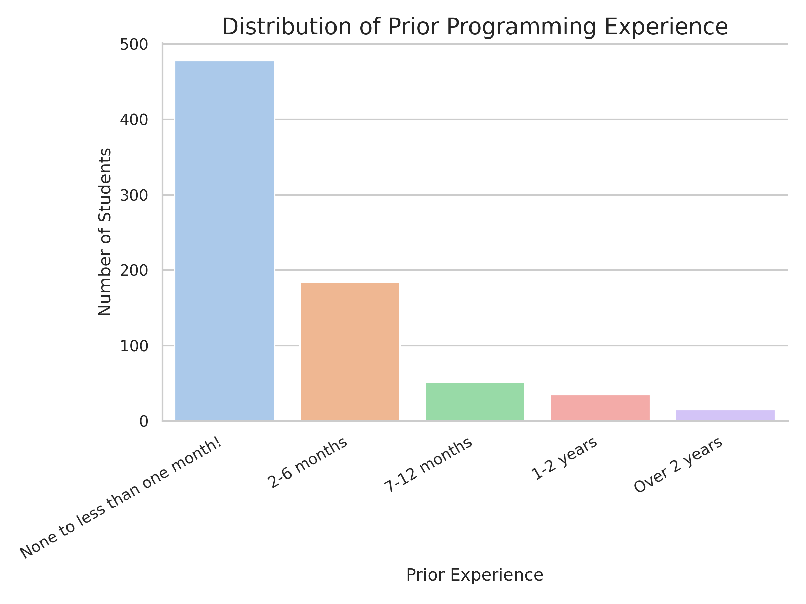
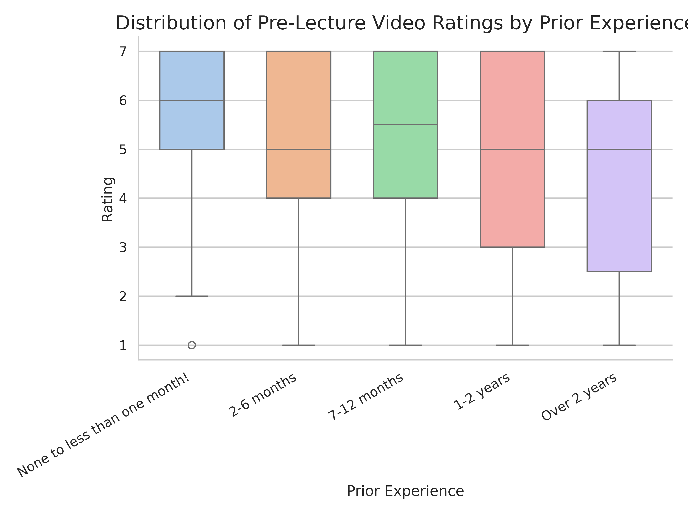
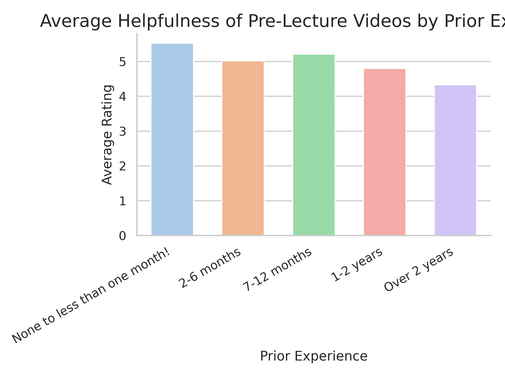

---
# Do not edit the text between these lines!
layout: default
---

<!--Centering and style-->

<!--Image sizes-->

<!--Line Styling-->

<!--Getting rid of the title and adding my own-->

# Pre-Lecture Video Analysis
*By: Alexander Blatt*

## Summary:

### Introduction:
This analysis investigates whether students with less prior programming experience are more likely to support the implementation of pre-lecture videos in the University of North Carolina at Chapel Hill’s COMP 110 (Introduction to Programming) course.

Pre-lecture videos can offer significant benefits by allowing students to learn the concepts at their own pace, making class time more interactive, and providing an additional resource for reviewing material before quizzes.

### Method:
Using survey data from two sections of COMP 110 (n = 764), taught by Dr. Hinks and Dr. Alyssa, I examine the relationship between prior programming experience and the students’ ratings of pre-lecture videos.

The variable prior_exp categorizes students by experience level: None to less than one month, 2-6 months, 7-12 months, 1-2 years, and Over 2 years. The variable pre_lecture_videos measured perceived helpfulness of pre-lecture videos on a scale from 1 to 7, where 1 indicates the lowest preference, and 7 the highest.

To analyze this relationship, I applied a helper function I created, average_by_category, which calculates the average for each experience grouping. I then use the seaborn package to visualize the relationship between these variables.

### Hypothesis:
If students have less prior programming experience, then they will, on average, rate pre-lecture videos as more helpful compared to students with more experience.
---
## Data:

### *Count* Function:
Prior Experience:
{'None to less than one month!': 478, '2-6 months': 184, '7-12 months': 52, '1-2 years': 35, 'Over 2 years': 15}

Pre-Lecture Videos Rating:
{'1': 30, '2': 27, '3': 50, '4': 94, '5': 169, '6': 144, '7': 250}

### *Average* Function:
{'None to less than one month!': 5.527, '2-6 months': 5.016, '7-12 months': 5.212, '1-2 years': 4.8, 'Over 2 years': 4.333}
---
## Visualizations:

### Distribution of Prior Programming Experience:

### Distribution of Pre-Lecture Video Ratings by Prior Experience:

### Average Helpfulness of Pre-Lecture Videos by Prior Experience:

## Conclusion:
Based on the results, I recommend that the course incorporate optional pre-lecture videos to support student learning. Students with minimal experience (“None to less than one month!”) had the highest average rating for pre-class videos (5.527), while students with the most experience (“Over 2 years”) had the lowest preference (4.333). And although the data is not perfectly monotonic (e.g., ”7-12 months” (5.212) > “2-6 months” (5.016)), the overall downward trend suggests that pre-lecture videos are more valuable to students new to programming. 

One possible extension of this idea would be to offer two types of pre-lecture videos: one focused on the foundational explanations in a simplified manner, and another that goes more in-depth for students with stronger backgrounds, or who want to challenge themselves. This would allow those with less experience to build their skills at an appropriate pace, while providing more experienced students the opportunity to engage with the material at a deeper level. It may also give students who are unsure about committing to a computer science major a preview of what they could expect if they continue.

A potential trade-off to consider would be the resources required to implement this proposal. Creating short pre-lecture videos requires time and effort from professors, increasing their workload. Even recording lecture videos would require time to set up the equipment and potentially edit the videos. Additionally, some students (perhaps those with more experience) may choose to skip the lectures and rely solely on the videos, which could reduce overall class engagement. 

Overall, this analysis supports the idea that incorporating pre-lecture videos could improve learning in COMP 110, especially for those with minimal prior programming experience.